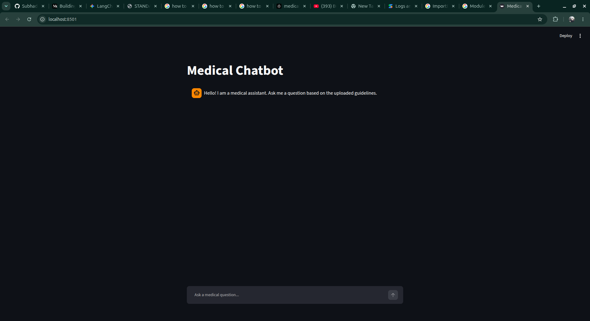
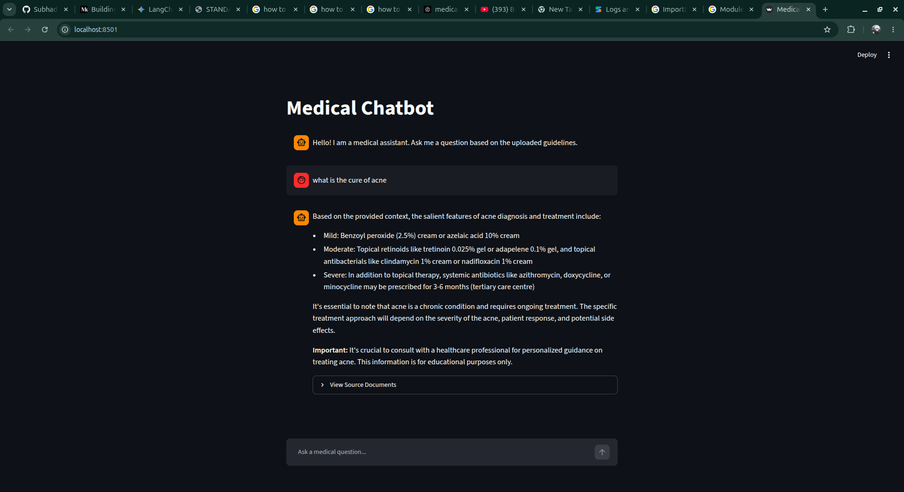

# 🏥 Medical Chatbot: Local RAG Pipeline

[](https://www.python.org/)
[](https://streamlit.io/)
[](https://www.langchain.com/)
[](https://www.pinecone.io/)
[](https://ollama.com/)

An end-to-end Retrieval-Augmented Generation (RAG) system built to answer complex medical questions using domain-specific PDF data. This project emphasizes **Infrastructure as Code (IaC)** by programmatically managing cloud vector infrastructure, features high-performance localized text embeddings, and provides a beautiful interface with source tracking for complete transparency.

---

## 📸 Application Screenshots Demo

### Screenshots
<p align="center">
  
</p>

<p align="center">
  
</p>

---

## 🚀 Key Features

* **Local-First Compute & Privacy:** Leverages local LLMs (`llama3`) and state-of-the-art embedding models (`mxbai-embed-large`) via Ollama to keep data compute private and cost-efficient.
* **Resilient Vector Infrastructure:** Features self-healing ingestion logic that programmatically checks, initializes, and provisions a Serverless Pinecone Index with strict dimension mapping ($1024$ dimensions, Cosine metric).
* **Deterministic Metadata Filtering:** Implements isolated metadata processing to clean source paths, optimizing downstream vector retrieval and eliminating payload overhead.
* **Recruiter-Highlight UI:** A clean Streamlit interface with full asynchronous feedback loaders, real-time context-aware answers, and a **"View Source Documents" Dropdown** that visually references the precise source document and page number utilized by the LLM.

---

## 🛠️ Tech Stack & Architecture

* **Orchestration Framework:** LangChain (Core, Vector Stores, Ollama Integrations)
* **LLM Engine:** ChatOllama (`llama3`)
* **Vector Embeddings:** `mxbai-embed-large:latest`
* **Vector Database:** Pinecone Serverless (AWS `us-east-1`)
* **Frontend UI:** Streamlit
* **Text Chunking:** Recursive Character Text Splitter ($1000$ chunk size, $200$ overlap)

---

## 📂 Project Structure

```text
Medical-Chatbot/
├── app/
│   ├── __pycache__/      
│   ├── ingest.py         # Automated PDF parsing, chunking, and database provisioning
│   ├── retrival.py       # Core RAG orchestration chain mapping & context-stuffing
│   └── utils.py          # Centralized configuration and medical system prompts
├── data/                 
│   └── medical book 1.pdf # Raw domain-specific PDF knowledge base
├── images_and_videos/    # UI screenshots and project demonstration assets
│   ├── medical_chatbot_image_2.png
│   ├── medical_chatbot_image.png
│   └── movie_recommendation_sy...
├── notebook/             
│   └── book.ipynb        # Jupyter notebook for exploratory data analysis and testing
├── venv/                 # Isolated Python virtual environment
├── .env                  # Protected environment variables (API keys)
├── .gitignore            # Excludes virtual environments and sensitive credentials
├── LICENSE               # Open-source licensing for the repository
├── main.py               # Central application entry point and sub-process launcher
├── README.md             # Project documentation
├── requirements.txt      # Pinned dependencies for reproducible builds
└── streamlit_app.py      # Streamlit user interface and session state manager
```

---

## 🔧 Installation & Setup Guide
1. Prerequisites
Ensure you have Python 3.11 installed on your system. You must also have Ollama installed and running locally.

Download the required local models via your terminal:

``` bash
ollama pull llama3
ollama pull mxbai-embed-large
```

## 2. Clone and Navigate
Clone the repository to your local workspace:

``` bash
git clone https://github.com/Subhadip-cloudCoder/Medical-Chatbot.git
cd Medical-Chatbot
```

## 3. Environment Virtualization
Create and activate an isolated Python environment:

``` bash
python3 -m venv venv
source venv/bin/activate
```

## 4. Install Dependencies
Ensure all libraries are perfectly pinned and resolved:

``` bash
pip install -r requirements.txt
```

## 5. Set Up Infrastructure Credentials
Create a .env file in the root directory and securely paste your Pinecone authorization token:

``` bash
PINECONE_API_KEY="your_secret_pinecone_api_key_here"
```

---

# 💻 How to Run

## Step 1: Ingest Your Data
Place your reference medical PDFs inside the data/ folder. Then, run the automated ingestion script. This dynamically creates your vector indices on the cloud if they do not exist and processes the documents:

``` bash
python3 app/ingest.py
```

## Step 2: Launch the App Interface
Execute the central app wrapper, which boots the full multi-threaded Streamlit dashboard directly in your default browser:

``` bash
python3 main.py
```

---

# 🎯 Conclusion

This system exemplifies modern AI engineering principles: decoupling ingestion patterns from retrieval pipelines, handling runtime exceptions caused by cold-start vector architectures, and rendering citations transparently to the user. It stands as a production-grade blueprint for scalable, localized enterprise search applications.

---

## 📬 Let's Connect!

I enjoy discussing Data Science, Machine Learning, and innovative tech projects. Whether you have a question about this model, some feedback, or just want to connect, feel free to reach out!

<br>

**Subhadip Biswas**

[](mailto:subhadip2622@gmail.com)

[](https://github.com/Subhadip-cloudCoder)

[](https://x.com/subhadipcodes?s=11)

[](https://www.linkedin.com/in/subhadip-biswas-ba0a5a419)

<br>

<p align="center">

  <b>⭐️ If you found this project helpful or interesting, please consider giving it a star! ⭐️</b>

</p>
